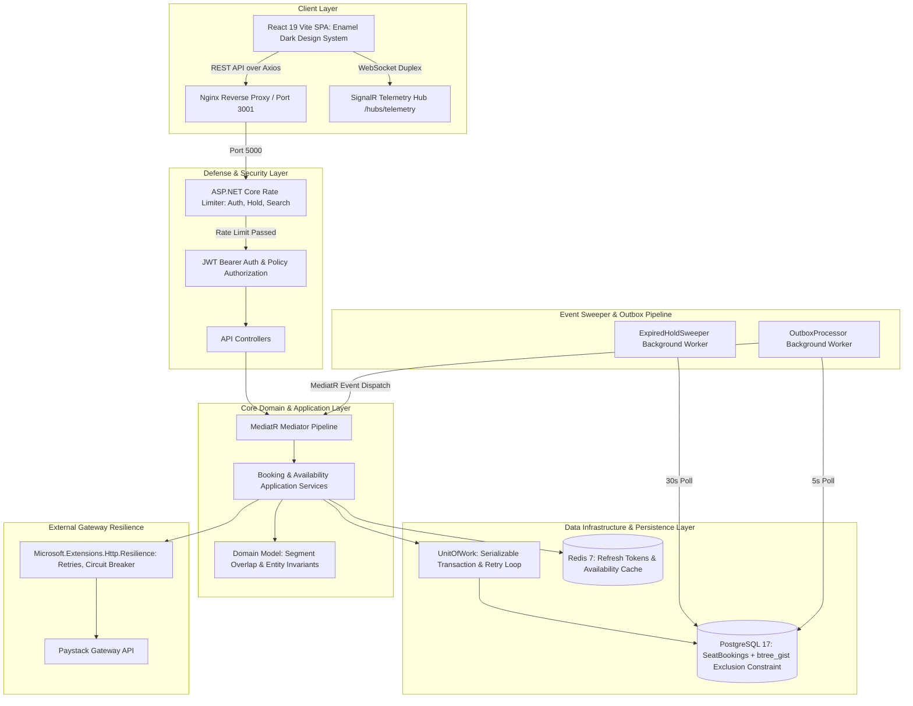

# BitRoute

A backend for booking seats on fixed-route transport, built in C# / .NET. The defining feature is segment-based seat inventory: a single physical seat can be sold to several passengers as long as their journeys do not overlap. A passenger riding A to C and another riding C to E can share the same seat on the same departure.

## Table of contents

- [The problem](#the-problem)
- [The core invariant](#the-core-invariant)
- [System components](#system-components)
- [Tech stack](#tech-stack)
- [Architecture](#architecture)
- [Domain model](#domain-model)
- [Booking lifecycle](#booking-lifecycle)
- [Identity and auth](#identity-and-auth)
- [Payments](#payments)
- [Real-time telemetry](#real-time-telemetry)
- [Scheduled vs realtime booking](#scheduled-vs-realtime-booking)
- [Scalability and reliability](#scalability-and-reliability)
- [Testing](#testing)
- [API overview](#api-overview)
- [Getting started](#getting-started)
- [Roadmap](#roadmap)
- [What this project demonstrates](#what-this-project-demonstrates)

## The problem

A route is an ordered sequence of stops. Take a route A, B, C, D, E. Those four gaps (A-B, B-C, C-D, D-E) are legs. A vehicle running this route has a fixed number of seats, and each seat can carry a different passenger on each leg, provided nobody books overlapping legs on the same seat.

Give each stop an index along the route:

```text
A = 0    B = 1    C = 2    D = 3    E = 4
```

A booking occupies a seat over the half-open interval `[boarding_index, alighting_index)`. A trip from A to C occupies `[0, 2)`. A trip from C to E occupies `[2, 4)`. Those two intervals do not overlap, so the same seat can serve both passengers.

```text
Route:   A --------- B --------- C --------- D --------- E
Seat 1:  | Passenger 1 (A to C)  | Passenger 2 (C to E)  |
Seat 2:  | Passenger 3 (A to E)                          |
Seat 3:  | available  | Passenger 4 (B to D)  | available |
```

Seat 1 is the whole idea: one physical seat, two paying passengers, no conflict.

## The core invariant

Two bookings on the same seat conflict if and only if their intervals overlap:

```text
ExistingStart < RequestedEnd  AND  ExistingEnd > RequestedStart
```

Everything in the system exists to protect this rule under concurrent load. Availability is the inverse: a seat is free for a journey from `i` to `j` when no existing active booking on that seat satisfies the overlap condition.

```sql
SELECT s.seat_id
FROM seats s
WHERE s.vehicle_id = @vehicleId
  AND NOT EXISTS (
    SELECT 1
    FROM seat_bookings b
    WHERE b.schedule_id   = @scheduleId
      AND b.travel_date   = @travelDate
      AND b.seat_id       = s.seat_id
      AND b.status        IN ('held', 'confirmed')
      AND b.boarding_index < @j
      AND b.alighting_index > @i
  );
```

### Enforcing it under concurrency

The race condition is real: two requests both read seat 1 as free for overlapping legs, and both try to insert. A plain unique constraint cannot catch this, because the conflicting intervals are not identical. BitRoute defends the invariant on two fronts.

**Serializable transactions.** The validate-then-insert sequence runs inside an explicit transaction at `IsolationLevel.Serializable`. PostgreSQL implements this with serializable snapshot isolation, which detects the conflict and aborts one of the two transactions, so the booking path needs a retry loop on serialization failures (SQLSTATE `40001`).

**A database exclusion constraint.** As a hard guarantee that does not depend on getting the transaction code perfect, a PostgreSQL exclusion constraint backed by `btree_gist` makes overlapping bookings physically impossible to store.

```sql
CREATE EXTENSION IF NOT EXISTS btree_gist;

ALTER TABLE seat_bookings
ADD CONSTRAINT no_overlapping_legs
EXCLUDE USING gist (
  schedule_id WITH =,
  travel_date WITH =,
  seat_id     WITH =,
  int4range(boarding_index, alighting_index, '[)') WITH &&
) WHERE (status IN ('held', 'confirmed'));
```

Using both is deliberate. Serializable isolation keeps the application logic correct and explainable, and the exclusion constraint is the backstop that holds even if a future code change slips past the transaction boundary. Npgsql maps the range to `NpgsqlRange<int>` in EF Core.

## System components

### 1. Identity and auth domain

Stateless, cryptographically signed JWT access tokens secure the API. Access windows are short, paired with a Redis-backed refresh-token sliding lifecycle so sessions stay alive without thrashing the primary database. Passwords are hashed with ASP.NET Core Identity.

### 2. Multi-leg reservation domain

PostgreSQL with EF Core, using rich domain entities that run the overlap evaluation inside their own object boundaries rather than in anemic services. Transactional protection (Serializable isolation plus the exclusion constraint) prevents multi-threaded race conditions.

### 3. Asynchronous payment processing (Stripe)

A decoupled, server-to-server webhook listener. No sensitive PCI data is stored. Webhook payloads are verified against Stripe's cryptographic signature before anything is trusted, then a MediatR notification is published so the checkout is decoupled from the core application pipeline.

### 4. Real-time telemetry tracking

ASP.NET Core SignalR over WebSockets opens persistent duplex channels that stream live driver GPS data, used to compute active booking windows on the fly for real-time standby passengers.

## Tech stack

| Concern | Choice |
| --- | --- |
| Language / runtime | C# / ASP.NET Core (.NET 10) |
| Database | PostgreSQL 17 (with `btree_gist`) |
| ORM | EF Core (Npgsql / SQLite for tests) |
| Caching / token store | Redis 7 |
| Identity | ASP.NET Core Identity (password hashing) + JWT bearer auth |
| In-process events | MediatR |
| Outbox & Sweeper | Hosted BackgroundServices (`OutboxProcessor`, `ExpiredHoldSweeper`) |
| Rate Limiting | ASP.NET Core Rate Limiting (fixed-window policies + `ApiResponse.Error` 429 envelope) |
| Gateway Resilience | `Microsoft.Extensions.Http.Resilience` (exponential retries, circuit breaker, timeouts) |
| Payments | Paystack (webhooks, HMAC-SHA512 fixed-time signature verification) |
| Real-time | ASP.NET Core SignalR (WebSockets) |
| Frontend SPA | React 19, TypeScript 5, Vite 6, Tailwind CSS 3 |
| Testing | xUnit, WebApplicationFactory, NetArchTest, Moq |
| Local infra | Docker Compose |

## Architecture



The solution is split into four backend projects plus a Vite React frontend:

- **Api**: controllers, SignalR telemetry hub, Paystack webhook listener, JWT bearer authentication, rate limiting, and exception handling middleware.
- **Application**: use cases, booking and availability services, MediatR handlers, DTOs, and FluentValidation.
- **Domain**: rich domain entities, value objects (`Segment`), domain events (`SeatHoldExpiredEvent`), and overlap invariants.
- **Infrastructure**: EF Core, `btree_gist` exclusion-constraint migration, Redis token & availability cache stores, hosted background workers (`ExpiredHoldSweeper`, `OutboxProcessor`), and Paystack client with resilience handlers.
- **Frontend**: Vite React 19 SPA with enamel departure board dark design system, SignalR telemetry client, and operator management console.

The read path (availability) is cached in Redis and invalidated on writes. The write path (booking) is strongly consistent and guarded by both the Serializable transaction retry loop and the database exclusion constraint.

## Domain model

The relational chain is `Route -> Schedule -> ScheduleLeg -> SeatBooking`.

- **User**: account, roles (`Passenger`, `Operator`, `Admin`).
- **Stop**: a named location with an order index along a route.
- **Route**: an ordered set of stops, the geography.
- **Schedule**: a departure of a route by a vehicle, carrying departure time and legs.
- **ScheduleLeg**: an ordered leg between two consecutive stops on a schedule, with its index and fare.
- **Vehicle / Seat**: the physical seats a schedule's vehicle provides.
- **SeatBooking**: a user, a schedule, a travel date, a seat, a boarding index, an alighting index, a status (`Held`, `Confirmed`, `Expired`, `Cancelled`), a price in kobo, and a hold expiry.
- **OutboxMessage**: an event type, serialized JSON payload, retry count, next attempt UTC timestamp, and processed UTC timestamp.

Pricing for a journey is the sum of the `ScheduleLeg` fares for the legs traversed, so A to C costs the A-B fare plus the B-C fare.

## Booking lifecycle

```text
   create booking
        |
        v
     [ HELD ] --- hold expires ---> [ EXPIRED ]  (seat released via ExpiredHoldSweeper)
        |
   payment confirmed (Paystack HMAC-SHA512 webhook -> MediatR)
        |
        v
  [ CONFIRMED ]
        |
   cancellation
        |
        v
  [ CANCELLED ]  (seat released)
```

A booking is created in `HELD` state, which reserves the seat and starts a 10-minute hold window. The seat stays excluded from availability while held. An `ExpiredHoldSweeper` background service releases holds that expire before payment completes and stages outbox messages. A confirmed Paystack payment transitions the booking to `CONFIRMED`.

## Identity and auth

Passwords are hashed with ASP.NET Core Identity. Login issues a short-lived JWT access token carrying the user's claims, paired with a refresh token whose sliding expiration is tracked in Redis rather than the primary database. Each refresh extends the window and rotates the token, which limits the damage from a leaked token. Authorization is policy-based and ownership-aware: an operator manages only their own schedules, a passenger sees only their own bookings.

For a plain-language walkthrough of the refresh-token design (rotation, token families, reuse detection, and the atomic consume step), see [docs/refresh-token-system.md](docs/refresh-token-system.md).

## Payments

Payment is tied to the hold, so a seat is never confirmed without money and never blocked indefinitely without payment.

```text
create booking (HELD)
        |
        v
initialize Paystack transaction  --->  return checkout URL & reference
        |
   user pays
        |
        v
Paystack webhook  --->  verify HMAC-SHA512 signature  --->  publish MediatR PaymentConfirmedNotification
        |               (constant-time FixedTimeEquals)               |
   failure or timeout                                                 v
        |                                                    PaymentConfirmedHandler
        v                                                    confirms booking & invalidates cache
release hold (EXPIRED)
```

Two rules that matter: verify the Paystack signature using `CryptographicOperations.FixedTimeEquals` before trusting the payload, and dedupe on Paystack's event reference so a re-delivered webhook does not confirm twice. No card data touches the system. Money is stored as integer minor units (kobo), never a float.

## Real-time telemetry & analytics

A SignalR hub (`/hubs/telemetry`) holds persistent duplex WebSockets. Driver clients push GPS pings, which the server maps onto the schedule's legs. Historical breadcrumb logs are persisted in PostgreSQL (`VehicleTelemetryLog`) and queried via `GET /schedules/{id}/telemetry/history`. Leg-by-leg occupancy rates over segment intervals `[BoardingIndex, AlightingIndex)` and confirmed revenue are calculated via `GET /schedules/{id}/analytics` and rendered on the operator console (`OperatorTab.tsx`).

## Scheduled vs realtime booking

There is one booking path, not two. The difference is timing: scheduled booking reserves a future-dated departure, realtime booking reserves one departing now, often informed by the live telemetry above. A recurring Hangfire job keeps the bookable date window open, and it is idempotent so re-runs never duplicate anything.

## Scalability and reliability

- **Caching**: availability reads are cached in Redis, keyed by schedule, travel date, and leg range, and invalidated on every booking write.
- **Rate limiting**: applied to the booking and payment endpoints.
- **Idempotency keys**: accepted on booking creation and enforced on Stripe webhooks.
- **Outbox pattern**: domain events such as "booking confirmed" are written in the same transaction as the booking, then dispatched by a worker. This survives a crash between the database commit and the email or notification.
- **Observability**: structured logging with Serilog, a correlation id per request, and optional OpenTelemetry traces and metrics.

## Testing

The overlap logic is pure, so it is unit-tested exhaustively: given a set of bookings and a requested journey, is the seat available or not. On top of that, integration tests run against real PostgreSQL using Testcontainers.

The most important test fires many parallel booking requests at the same seat and overlapping legs and asserts that exactly one succeeds. A passing concurrency test is the single most convincing piece of evidence that the inventory engine is correct.

## API overview

A representative slice of the endpoints. Shapes are indicative.

| Method | Path | Purpose |
| --- | --- | --- |
| POST | `/auth/register` | Create a passenger account |
| POST | `/auth/login` | Obtain access and refresh tokens |
| POST | `/auth/refresh` | Rotate the refresh token (Redis-backed) |
| POST | `/routes` | Create a route with ordered stops (operator) |
| POST | `/schedules` | Define a schedule, its legs, and vehicle (operator) |
| GET | `/schedules/{id}/availability?date={d}&from={i}&to={j}` | Seats available for a journey |
| POST | `/bookings` | Hold a seat for a journey (idempotent) |
| POST | `/bookings/{id}/pay` | Create a Stripe PaymentIntent for a held booking |
| POST | `/webhooks/stripe` | Confirm payment (Stripe callback) |
| GET | `/bookings/me` | List the caller's bookings |
| DELETE | `/bookings/{id}` | Cancel a booking and release the seat |
| WS | `/hubs/telemetry` | SignalR channel for live vehicle tracking |

## Getting started

Prerequisites: the .NET SDK, Docker, and Docker Compose.

```bash
# 1. Clone
git clone https://github.com/<your-username>/bitroute.git
cd bitroute

# 2. Start PostgreSQL and Redis
docker compose up -d

# 3. Apply migrations (the design-time factory reads ConnectionStrings__Postgres)
ConnectionStrings__Postgres="Host=localhost;Port=5432;Database=bitroute;Username=bitroute;Password=bitroute" \
  dotnet ef database update --project src/BitRoute.Infrastructure --startup-project src/BitRoute.Infrastructure

# 4. Run the API
dotnet run --project src/BitRoute.Api

# 5. Open the API docs
# http://localhost:5000/swagger
```

Configuration (connection strings, JWT signing key, Stripe keys, Redis) is read from `appsettings.json` and environment variables. Do not commit secrets. For local Stripe webhooks, use the Stripe CLI to forward events to `/webhooks/stripe`.

## Roadmap

Built as a series of phases, each shippable on its own. Build a thin vertical slice through Phase 3 first, then layer the rest.

- **Phase 1, Clean Architecture setup**: solution layout via the .NET CLI, the four projects, and the dependency-direction check (Domain and Application reference nothing outward). Overlap rules embedded in the entities, not in anemic services.
  - [x] Solution scaffolded via the .NET CLI with the four projects (Api, Application, Domain, Infrastructure).
  - [x] Inward project references wired: Application and Infrastructure reference only Domain; Api references Application and Infrastructure as the composition root.
  - [x] Solution file populated, root `.gitignore` added, and build artifacts untracked.
  - [x] `Segment` value object owns the half-open overlap rule as behavior, not an anemic service.
  - [x] xUnit test project under `tests/` with exhaustive `Segment` overlap unit tests, including the half-open boundary case.
  - [x] Automated dependency-direction check (NetArchTest) that fails the build if a layer references outward.
- **Phase 2, decoupled identity**: ASP.NET Core Identity password hashing, JWT issuance with user claims, and the Redis-backed sliding refresh-token store.
  - Decisions: login by email; 60-minute access token and 30-day sliding refresh; refresh tokens are one-time-use with reuse detection that revokes the session family; passengers self-register while operators and admins are provisioned (no role accepted from the client).
  - [x] Domain: `User` concept and `Role` enum (passenger, operator, admin), plus the Identity boundary decision (rich Domain user vs Infrastructure `IdentityUser`).
  - [x] Domain: refresh-token model (token, expiry, session-family id, used flag) with reuse-detection rules as behavior, and auth domain exceptions.
  - [x] Infrastructure: ASP.NET Core Identity on EF Core + PostgreSQL for password hashing, with the Identity migration.
  - [x] Infrastructure: JWT generator (60-minute access token carrying user claims) behind a Domain-defined interface.
  - [x] Infrastructure: Redis-backed refresh-token store with the 30-day sliding window, rotation, reuse detection, and family revocation.
  - [x] Application: auth service orchestrating register, login, refresh, and logout, with record DTOs and FluentValidation.
  - [x] Api: auth endpoints (`/auth/register`, `/auth/login`, `/auth/refresh`, logout), JWT bearer auth, policy-based authorization, and DI registration.
  - [x] Api: map the new auth exceptions in `ExceptionMiddleware`.
  - [x] Cross-cutting: admin seeding and the admin-only operator provisioning path.
  - [x] Tests: login, refresh rotation, reuse detection revoking the family, and authorization failures.
- **Phase 3, high-concurrency overlap engine**: the `Route -> Schedule -> ScheduleLeg -> SeatBooking` schema, the leg-overlap query, Serializable transactions with a retry loop, and the exclusion constraint backstop. Plus the hold-and-expiry pattern.
  - [x] Relational schema: `Route`, `Stop`, `Vehicle`, `Seat`, `Schedule`, `ScheduleLeg`, and `SeatBooking` mapped via EF Core.
  - [x] Segment-based availability: query logic verifies leg overlaps using index bounds `[boardingIndex, alightingIndex)`.
  - [x] Concurrency resilience: Serializable transaction runner in `UnitOfWork` with SQLSTATE `40001` conflict identification and exponential backoff retry.
  - [x] DB Exclusion Constraint: PostgreSQL `btree_gist` extension and range-level exclusion constraint preventing overlapping legs on the same seat.
  - [x] Hold-and-expiry lifecycle: seat reservations default to a 10-minute hold window, swept and cleared by the `ExpiredHoldSweeper` background service.
  - [x] Testing quality gate: complete unit tests (`BookingServiceTests`) and multi-threaded concurrency integration tests (`ConcurrencyTests`) verifying conflict rejection.
- **Phase 4, webhook architecture & payment settlement**: Paystack server-side integration, signature-verified callback endpoint, idempotent event handling, and MediatR notifications on confirmation.
  - [x] Paystack transaction initialization with minor unit (kobo) currency calculation and callback URL parameterization.
  - [x] Constant-time HMAC-SHA512 signature verification (`CryptographicOperations.FixedTimeEquals`) preventing timing attacks.
  - [x] Decoupled order settlement via MediatR `PaymentConfirmedNotification` and `PaymentConfirmedHandler`.
  - [x] Idempotency deduplication preventing replayed webhooks from processing twice.
- **Phase 5, real-time WebSockets & fleet analytics**: SignalR telemetry hub, historical driver breadcrumb logs, leg-by-leg occupancy rates, and revenue analytics.
  - [x] SignalR telemetry hub (`/hubs/telemetry`) streaming live driver GPS location pings over persistent WebSocket channels.
  - [x] Historical telemetry breadcrumb storage (`VehicleTelemetryLog`) and query endpoint (`GET /schedules/{id}/telemetry/history`).
  - [x] Leg-by-leg departure occupancy calculation over segment intervals `[BoardingIndex, AlightingIndex)` and revenue metrics (`GET /schedules/{id}/analytics`).
  - [x] Full UI integration in `OperatorTab.tsx` displaying live metrics, progress bars, and breadcrumb trails.
- **Phase 6, testing quality gates, rate limiting & gateway resilience**: unit tests over overlap logic, integration tests, ASP.NET Core Rate Limiting, HTTP client resilience handlers, and multi-container Docker Compose.
  - [x] 100 passing unit and integration tests across 5 test projects (`Domain.Tests`, `Application.Tests`, `Infrastructure.Tests`, `Api.Tests`, `ArchitectureTests`).
  - [x] Defense-in-depth ASP.NET Core Rate Limiting (`AuthPolicy`, `HoldPolicy`, `PublicSearchPolicy`) with standard 429 JSON error envelopes.
  - [x] Production Outbox pattern (`OutboxProcessor`) with MediatR dispatch, exponential backoff retries, dead-lettering, and Redis cache invalidation.
  - [x] Gateway resilience via `Microsoft.Extensions.Http.Resilience` (3 retries with exponential backoff, circuit breaker, 10s timeouts).
  - [x] Docker Compose multi-container stack (`postgres`, `redis`, `api`, `web`) with healthcheck dependency ordering.

## What this project demonstrates & Technical Defense Guides

For anyone reviewing this as a portfolio piece or preparing to defend these architectural concepts in technical interviews, detailed deep-dive guides—including 12-year-old analogies, trade-off analyses, production code snippets, and Mermaid flowcharts—are available in the `docs/` folder:

1. **[Concurrency-Correct Segment Inventory](docs/01-concurrency-correct-segment-inventory.md)**: Defended by both Serializable transactions with exponential backoff retries and a PostgreSQL `btree_gist` exclusion constraint.
2. **[Asynchronous Signature-Verified Paystack Webhook Settlement](docs/02-asynchronous-paystack-webhook-settlement.md)**: Decoupled through MediatR, with constant-time HMAC-SHA512 `FixedTimeEquals` signature verification, idempotent deduplication, and minor-unit (kobo) money handling.
3. **[Reserve-Then-Confirm Hold & Production Outbox Pattern](docs/03-reserve-then-confirm-hold-and-outbox-pattern.md)**: Featuring an automatic `ExpiredHoldSweeper` background worker, transactional outbox staging, exponential backoff retries, and dead-lettering.
4. **[Real-Time Telemetry & Fleet Analytics](docs/04-realtime-telemetry-and-fleet-analytics.md)**: Combining SignalR WebSocket streaming, historical breadcrumbs (`VehicleTelemetryLog`), and leg-by-leg departure occupancy calculations over segment intervals `[BoardingIndex, AlightingIndex)`.
5. **[Production Defense-in-Depth & System Resilience](docs/05-production-defense-in-depth-and-resilience.md)**: Featuring ASP.NET Core rate limiting policies with custom 429 JSON error envelopes, `Microsoft.Extensions.Http.Resilience` handlers, Redis sliding refresh-token rotation with reuse detection, and multi-container Docker Compose orchestration.
6. **[Frontend Design System & UI Architecture](docs/06-frontend-design-system-and-ui-architecture.md)**: Featuring the "Enamel Departure Board at Night" domain design tokens, physical ticket perforation components, `AbortController` network cancellation, and WAI-ARIA tab accessibility.
7. **[Backend Clean Architecture & System Design Patterns](docs/07-backend-architecture-and-clean-design-patterns.md)**: Featuring Clean Architecture layer isolation enforced by NetArchTest rules, DDD aggregate root invariants, MediatR CQRS event buses, and dependency injection lifecycle scoping.
8. **[Production Operations, Monitoring & Troubleshooting Runbook](docs/08-production-operations-monitoring-and-troubleshooting.md)**: Featuring health probes (`/health`, `pg_isready`, `redis-cli ping`), database indexing strategies (`int4range`, partial outbox index), and incident runbooks for serialization retries, webhook troubleshooting, and WebSocket proxying.

These represent production full-stack concerns beyond standard CRUD, designed to demonstrate enterprise architecture principles in senior .NET software engineering interviews.

---

Author: [your name] · [GitHub] · [LinkedIn]
