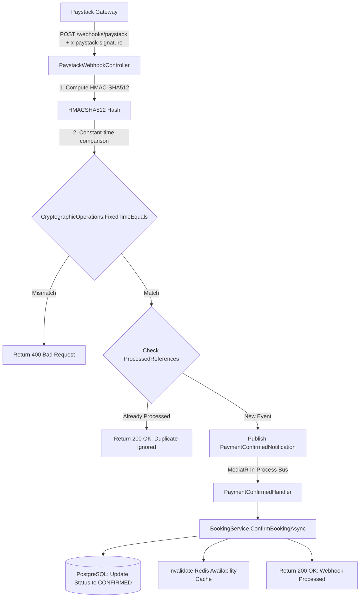

# Asynchronous Signature-Verified Paystack Webhook Settlement

This document details how BitRoute handles payment settlement asynchronously, securely, and idempotently using Paystack webhooks, MediatR events, and constant-time signature verification.

---

## 1. Explained for a 12-Year-Old

Imagine you order a toy online and want to pay for it:

1. **The Secret Handshake**: When Paystack sends a message saying "Hey! The customer paid \$10!", how do we know it's really Paystack and not a hacker trying to steal toys? Paystack puts a **secret digital wax seal (HMAC-SHA512 signature)** on the letter.
2. **Checking the Seal**: We compare the wax seal letter-by-letter, taking the exact same amount of time for every letter so no sneaky hacker can guess our password by timing how fast we check!
3. **No Double Presents**: If Paystack sends the same letter twice because the internet lagged, we check our notebook (`ProcessedReferences`). If we already gave out the toy for reference `#123`, we say "Thank you, already got it!" and don't double-ship!
4. **Minor Units (Kobo)**: We measure all money in tiny pennies (kobo). \$10.50 becomes `1050` kobo. That way computers never make rounding mistakes like `$10.500000000000001`!

---

## 2. Deep-Dive Interview Defense Guide

### Technical Explanation

Payment processing in high-scale distributed systems must adhere to three core principles:
1. **Zero Trust Webhook Ingestion**: Never trust incoming HTTP payloads without cryptographic proof.
2. **Constant-Time Verification**: Prevent timing side-channel attacks during signature comparison.
3. **Idempotency & Event Decoupling**: Isolate webhooks from core transactional pipelines using in-process event buses (MediatR) and deduplication registries.

### Constant-Time Signature Defense

Paystack includes an `x-paystack-signature` header containing an HMAC-SHA512 hash of the raw HTTP request body using the shared `Paystack:SecretKey`.

If an application uses standard `string == string` or `string.Equals()` comparison, the comparison aborts at the first non-matching character. An attacker measuring response latency with sub-millisecond precision can guess the HMAC character-by-character (a **timing side-channel attack**).

BitRoute defends against this using `CryptographicOperations.FixedTimeEquals`:

```csharp
var computedBytes = Encoding.UTF8.GetBytes(Convert.ToHexStringLower(hash));
var headerBytes = Encoding.UTF8.GetBytes(signatureHeader.ToLowerInvariant());

if (computedBytes.Length != headerBytes.Length)
    return false;

return CryptographicOperations.FixedTimeEquals(computedBytes, headerBytes);
```

### Money Representation in Minor Units

All financial figures are stored as 64-bit integer minor units (kobo in NGN, cents in USD). Floating-point formats (`float`, `double`) violate IEEE 754 precision constraints for monetary transactions (e.g. `0.1 + 0.2 = 0.30000000000000004`).

---

## 3. Trade-Off Analysis & Why We Chose This Method

| Approach | Pros | Cons | Why BitRoute Chose / Rejected |
|---|---|---|---|
| **Synchronous In-Band Checkout** | Simpler request flow; immediate HTTP response. | Holds HTTP connection open during payment gateway authorization; prone to client timeouts and network disconnects. | ❌ **Rejected**: High failure rate on mobile devices. |
| **Standard String Equals Verification** | 1 line of code. | Vulnerable to side-channel timing attacks to forge webhook signatures. | ❌ **Rejected**: Security vulnerability. |
| **Direct Controller Database Mutation** | Easy to write. | Tightly couples payment HTTP endpoint to core booking domain logic. | ❌ **Rejected**: Violates Single Responsibility & Clean Architecture. |
| **Constant-Time HMAC + MediatR Event Decoupling** | Secure against timing attacks; idempotent deduplication; fully decoupled domain handlers. | Slightly more boilerplate code. | ✅ **CHOSEN**: Production standard for financial integration. |

---

## 4. Mermaid System Flowchart



---

## 5. Production Code Samples

### Fixed-Time HMAC Signature Verification
From `src/BitRoute.Infrastructure/Payments/PaystackService.cs`:

```csharp
public bool VerifyWebhookSignature(string payload, string signatureHeader)
{
    if (string.IsNullOrWhiteSpace(signatureHeader) || string.IsNullOrWhiteSpace(payload))
        return false;

    var keyBytes = Encoding.UTF8.GetBytes(_options.SecretKey);
    var payloadBytes = Encoding.UTF8.GetBytes(payload);

    using var hmac = new HMACSHA512(keyBytes);
    var hash = hmac.ComputeHash(payloadBytes);
    var computedBytes = Encoding.UTF8.GetBytes(Convert.ToHexStringLower(hash));
    var headerBytes = Encoding.UTF8.GetBytes(signatureHeader.ToLowerInvariant());

    if (computedBytes.Length != headerBytes.Length)
        return false;

    return CryptographicOperations.FixedTimeEquals(computedBytes, headerBytes);
}
```

### Paystack Webhook Controller Endpoint
From `src/BitRoute.Api/Controllers/PaystackWebhookController.cs`:

```csharp
[HttpPost]
public async Task<IActionResult> HandleWebhook(CancellationToken cancellationToken)
{
    using var reader = new StreamReader(Request.Body);
    var payload = await reader.ReadToEndAsync(cancellationToken);

    var signatureHeader = Request.Headers["x-paystack-signature"].ToString();
    if (!_paystackService.VerifyWebhookSignature(payload, signatureHeader))
    {
        _logger.LogWarning("Invalid Paystack webhook signature header received.");
        return BadRequest(ApiResponse.Error("Invalid Paystack signature."));
    }

    var webhookEvent = JsonSerializer.Deserialize<PaystackWebhookEvent>(payload);
    if (webhookEvent == null || webhookEvent.Event != "charge.success")
    {
        return Ok();
    }

    var reference = webhookEvent.Data.Reference;
    var amount = webhookEvent.Data.Amount;

    lock (ProcessedLock)
    {
        if (ProcessedReferences.Contains(reference))
        {
            return Ok(ApiResponse.SuccessMessage("Duplicate event processed."));
        }
        ProcessedReferences.Add(reference);
    }

    if (Guid.TryParse(reference, out var bookingId))
    {
        await _publisher.Publish(new PaymentConfirmedNotification(bookingId, reference, amount), cancellationToken);
    }

    return Ok(ApiResponse.SuccessMessage("Paystack webhook processed successfully."));
}
```
