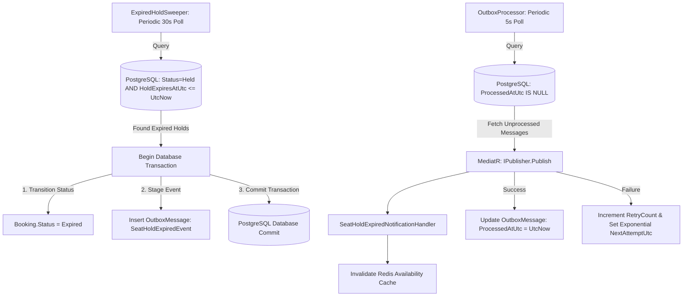

# Reserve-Then-Confirm Hold & Production Outbox Pattern

This document explains BitRoute's 10-minute temporary seat hold reservation pattern, automatic hold expiration sweeper, and transactional outbox pattern for reliable event delivery.

---

## 1. Explained for a 12-Year-Old

Imagine you go to a movie theater and pick **Seat 5**:

1. **The Temporary Sticky Note**: The box office puts a 10-minute sticky note on Seat 5 that says *"Held for Alex until 2:10 PM"*.
2. **The Timer Sweeper**: A worker robot (`ExpiredHoldSweeper`) walks around every few minutes checking sticky notes. If it's 2:11 PM and Alex hasn't paid, the robot takes off the sticky note so someone else can buy Seat 5!
3. **The Outbox Mailbox**: When the robot cancels an expired hold, it needs to send an email to Alex saying *"Your hold expired"*. But what if the internet crashes right when it tries to send the email?
4. **Writing a Letter First**: Instead of sending the email live, the robot drops an envelope into an **Outbox Mailbox** inside the database *at the exact same time* it releases the seat. Another worker (`OutboxProcessor`) picks up letters from the mailbox, sends them, and if the internet is down, it retries with exponential backoff!

---

## 2. Deep-Dive Interview Defense Guide

### Technical Explanation

### 1. The Reserve-Then-Confirm Hold Pattern
To prevent seats from being blocked indefinitely by users who abandon checkout, BitRoute implements temporary seat holds:
- When a user requests a booking, a `SeatBooking` is created in `Status = Held` with `HoldExpiresAtUtc = UtcNow + 10 minutes`.
- Held seats actively occupy segment inventory in database availability queries and the PostgreSQL exclusion constraint.
- If payment completes within 10 minutes, status transitions `Held` $\rightarrow$ `Confirmed`.
- If payment is not completed within 10 minutes, `ExpiredHoldSweeper` sweeps the expired records.

### 2. Dual-Database Transactional Outbox Pattern
In distributed systems, updating a database and publishing an event to a message broker (or sending an email/invalidating a cache) in separate network calls suffers from the **Dual-Write Problem**:
- If the database commit succeeds but the event publisher crashes, the event is lost forever.
- If the event publisher runs first but the database transaction rolls back, downstream consumers process phantom events.

**The Solution**: Write domain events as `OutboxMessage` rows in PostgreSQL **within the exact same database transaction** as the business state change.

```csharp
var outboxMessage = new OutboxMessage(
    eventType: notification.GetType().AssemblyQualifiedName!,
    content: JsonSerializer.Serialize(notification, notification.GetType()),
    createdAtUtc: DateTime.UtcNow
);
_dbContext.OutboxMessages.Add(outboxMessage);
await _dbContext.SaveChangesAsync(cancellationToken);
```

An asynchronous background service (`OutboxProcessor`) periodically queries pending `OutboxMessage` rows (`ProcessedAtUtc == null AND NextAttemptUtc <= UtcNow`), deserializes the payloads, dispatches them via MediatR `IPublisher`, and marks them as processed.

### Resiliency Features:
- **Exponential Backoff**: `NextAttemptUtc = UtcNow + 2^RetryCount seconds`.
- **Dead-Lettering**: After 5 failed attempts, the message is marked with `Error` payload and quarantined for manual inspection.

---

## 3. Trade-Off Analysis & Why We Chose This Method

| Approach | Pros | Cons | Why BitRoute Chose / Rejected |
|---|---|---|---|
| **Direct In-Line Event Dispatching** | Low latency; single execution flow. | If database succeeds but event handler fails (e.g. Redis disconnect), data is inconsistent. | ❌ **Rejected**: Dual-write vulnerability. |
| **Distributed Transactions (2PC)** | Strong consistency across database and message broker. | Complex, fragile, unsupported by modern cloud infrastructure and Redis. | ❌ **Rejected**: High latency and operational brittleness. |
| **Database CDC (Debezium / Kafka)** | Zero application outbox code; high throughput. | Heavy infrastructure overhead (Kafka, ZooKeeper/KRaft, Debezium connector setup). | ❌ **Overkill for Monolith**: Excellent for microservices, unnecessary complexity for core API. |
| **Transactional Outbox + Background Sweeper** | Guarantees At-Least-Once event delivery; zero external infrastructure dependencies; 100% ACID compliant. | Requires polling query overhead (mitigated by index on `(ProcessedAtUtc, NextAttemptUtc)`). | ✅ **CHOSEN**: Gold standard for reliable event-driven domain architecture. |

---

## 4. Mermaid System Flowchart



---

## 5. Production Code Samples

### Expired Hold Sweeper Background Service
From `src/BitRoute.Infrastructure/BackgroundServices/ExpiredHoldSweeper.cs`:

```csharp
protected override async Task ExecuteAsync(CancellationToken stoppingToken)
{
    while (!stoppingToken.IsCancellationRequested)
    {
        try
        {
            using var scope = _serviceScopeFactory.CreateScope();
            var bookingRepository = scope.ServiceProvider.GetRequiredService<IBookingRepository>();
            var unitOfWork = scope.ServiceProvider.GetRequiredService<IUnitOfWork>();
            var publisher = scope.ServiceProvider.GetRequiredService<IPublisher>();

            var expiredHoldIds = await bookingRepository.GetExpiredHoldIdsAsync(DateTime.UtcNow, stoppingToken);

            foreach (var bookingId in expiredHoldIds)
            {
                var booking = await bookingRepository.GetByIdAsync(bookingId, stoppingToken);
                if (booking != null && booking.Status == BookingStatus.Held)
                {
                    booking.ExpireHold(DateTime.UtcNow);
                    await publisher.Publish(new SeatHoldExpiredEvent(booking.Id, booking.ScheduleId, booking.TravelDate), stoppingToken);
                    await unitOfWork.SaveChangesAsync(stoppingToken);
                }
            }
        }
        catch (Exception ex)
        {
            _logger.LogError(ex, "Error occurred while sweeping expired seat holds.");
        }

        await Task.Delay(TimeSpan.FromSeconds(30), stoppingToken);
    }
}
```

### Outbox Processor Worker
From `src/BitRoute.Infrastructure/BackgroundServices/OutboxProcessor.cs`:

```csharp
protected override async Task ExecuteAsync(CancellationToken stoppingToken)
{
    while (!stoppingToken.IsCancellationRequested)
    {
        try
        {
            using var scope = _serviceScopeFactory.CreateScope();
            var dbContext = scope.ServiceProvider.GetRequiredService<ApplicationDbContext>();
            var publisher = scope.ServiceProvider.GetRequiredService<IPublisher>();

            var messages = await dbContext.OutboxMessages
                .Where(m => m.ProcessedAtUtc == null && m.NextAttemptUtc <= DateTime.UtcNow)
                .OrderBy(m => m.CreatedAtUtc)
                .Take(20)
                .ToListAsync(stoppingToken);

            foreach (var message in messages)
            {
                try
                {
                    var type = Type.GetType(message.EventType);
                    if (type != null)
                    {
                        var notification = JsonSerializer.Deserialize(message.Content, type);
                        if (notification != null)
                        {
                            await publisher.Publish(notification, stoppingToken);
                        }
                    }
                    message.MarkAsProcessed(DateTime.UtcNow);
                }
                catch (Exception ex)
                {
                    message.RecordFailure(ex.Message, DateTime.UtcNow);
                }
            }

            await dbDbContext.SaveChangesAsync(stoppingToken);
        }
        catch (Exception ex)
        {
            _logger.LogError(ex, "Error processing outbox messages.");
        }

        await Task.Delay(TimeSpan.FromSeconds(5), stoppingToken);
    }
}
```
