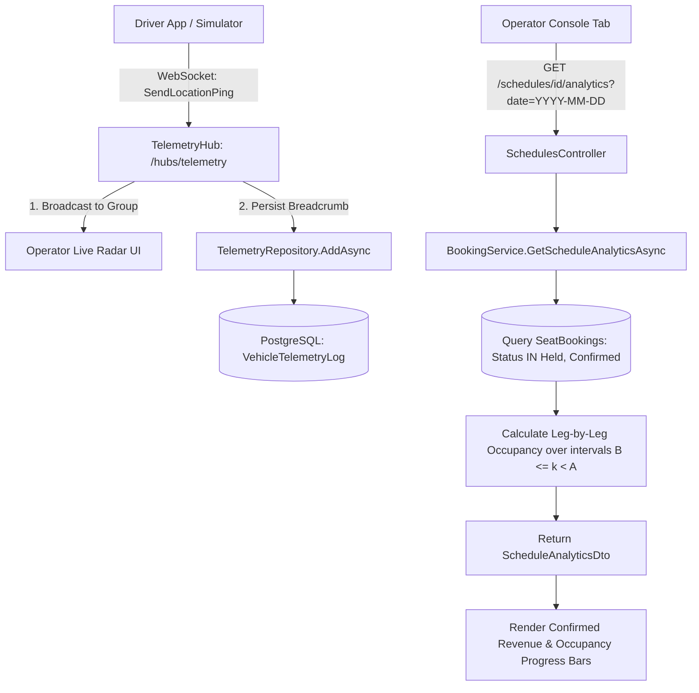

# Real-Time Telemetry & Fleet Analytics Architecture

This document details BitRoute's real-time vehicle GPS telemetry tracking via SignalR WebSockets, historical breadcrumb logging, and segment-based departure occupancy and revenue analytics.

---

## 1. Explained for a 12-Year-Old

Imagine a school bus driving along a route with 5 stops:

1. **Walkie-Talkie (SignalR)**: The driver has a special live walkie-talkie (`SignalR WebSocket`) that broadcasts their exact GPS location to the central station every few seconds.
2. **Breadcrumb Trail**: Every ping gets saved in a digital diary (`VehicleTelemetryLog`) like breadcrumbs left on a path. That way, the bus manager can look back and see exactly where the driver was 10 minutes ago!
3. **Seat Occupancy Math**: If a bus has 20 seats, and 5 passengers get on at Stop 0 (Lagos) and get off at Stop 1 (Ibadan), the bus is **25% full** on Leg 1. But if 15 more passengers get on at Stop 1, the bus is **100% full** on Leg 2!
4. **Live Dashboard**: The bus operator sees colorful progress bars on their screen updating in real time, so they know which legs are popular and how much money the route made!

---

## 2. Deep-Dive Interview Defense Guide

### Technical Explanation

### 1. Duplex Real-Time Telemetry Over SignalR
Driver clients maintain persistent WebSocket connections to `TelemetryHub` (`/hubs/telemetry`).
When a vehicle broadcasts a location update (`SendLocationPing`), the hub:
- Validates the leg index against schedule constraints.
- Broadcasts the update to all clients subscribed to the schedule group (`Clients.Group(scheduleId)`).
- Persists a timestamped `VehicleTelemetryLog` row in PostgreSQL for historical auditing.

### 2. Segment-Based Departure Occupancy & Revenue Analytics
Standard fleet analytics calculate total passenger bookings per vehicle. However, in segment-based transport, **capacity load varies per leg**.

For a schedule with legs $L_0, L_1, \dots, L_{n-1}$:
- A seat booking with boarding index $B$ and alighting index $A$ occupies **every leg $k$ where $B \le k < A$**.
- Leg occupancy $O_k$ is calculated as:
$$O_k = \sum \{ \text{Booking} \mid \text{Status} \in \{\text{Held}, \text{Confirmed}\}, \text{BoardingIndex} \le k < \text{AlightingIndex} \}$$
- Occupancy percentage $P_k$:
$$P_k = \left( \frac{O_k}{\text{TotalSeats}} \right) \times 100$$
- Confirmed Revenue $R$:
$$R = \sum \{ \text{Booking.PriceInKobo} \mid \text{Booking.Status} = \text{Confirmed} \}$$

---

## 3. Trade-Off Analysis & Why We Chose This Method

| Approach | Pros | Cons | Why BitRoute Chose / Rejected |
|---|---|---|---|
| **Short Polling (`GET /telemetry` every 2s)** | Easy to write; standard HTTP REST. | Massive HTTP overhead (headers, TCP handshake per request); destroys database and CPU under 1,000 drivers. | ❌ **Rejected**: Unscalable network thrashing. |
| **Long Polling** | Standard HTTP fallback. | High server memory retention; awkward connection holding logic. | ⚠️ **Fallback Only**: Handled automatically by SignalR if WebSockets fail. |
| **SignalR WebSockets Hub + Segment Analytics** | Lightweight full-duplex binary frame streaming; zero HTTP header overhead; real-time operator UI rendering. | Requires persistent server connection memory management. | ✅ **CHOSEN**: Gold standard for live vehicle tracking. |

---

## 4. Mermaid System Flowchart



---

## 5. Production Code Samples

### Leg-by-Leg Occupancy Calculation
From `src/BitRoute.Application/Booking/BookingService.cs`:

```csharp
public async Task<ScheduleAnalyticsDto> GetScheduleAnalyticsAsync(
    Guid scheduleId,
    DateOnly travelDate,
    CancellationToken cancellationToken = default)
{
    var schedule = await _scheduleRepository.GetByIdWithDetailsAsync(scheduleId, cancellationToken);
    if (schedule == null)
        throw new NotFoundException($"Schedule '{scheduleId}' was not found.");

    var activeBookings = await _bookingRepository.GetActiveBookingsForScheduleAsync(
        scheduleId, travelDate, cancellationToken);

    var totalConfirmedBookings = activeBookings.Count(b => b.Status == BookingStatus.Confirmed);
    var totalRevenueKobo = activeBookings
        .Where(b => b.Status == BookingStatus.Confirmed)
        .Sum(b => b.PriceInKobo);

    var totalSeats = schedule.Vehicle.Capacity;
    var legOccupancies = new List<LegOccupancyDto>();

    for (var i = 0; i < schedule.Legs.Count; i++)
    {
        var leg = schedule.Legs[i];
        var legIndex = i;

        // Count bookings whose segment covers leg index i: [BoardingIndex <= i < AlightingIndex]
        var occupiedSeats = activeBookings.Count(b => b.BoardingIndex <= legIndex && b.AlightingIndex > legIndex);
        var percentage = totalSeats > 0 ? (double)occupiedSeats / totalSeats * 100 : 0;

        legOccupancies.Add(new LegOccupancyDto(
            LegIndex: legIndex,
            StartStopName: leg.StartStop.Name,
            EndStopName: leg.EndStop.Name,
            OccupiedSeats: occupiedSeats,
            TotalSeats: totalSeats,
            OccupancyPercentage: Math.Round(percentage, 1)
        ));
    }

    return new ScheduleAnalyticsDto(
        ScheduleId: scheduleId,
        TravelDate: travelDate,
        TotalCapacity: totalSeats,
        TotalConfirmedBookings: totalConfirmedBookings,
        TotalRevenueKobo: totalRevenueKobo,
        LegOccupancies: legOccupancies
    );
}
```

### Telemetry Repository History Clamping
From `src/BitRoute.Infrastructure/Persistence/Repositories/TelemetryRepository.cs`:

```csharp
public async Task<IReadOnlyList<TelemetryPayload>> GetHistoryByScheduleIdAsync(
    Guid scheduleId,
    int limit = 50,
    CancellationToken cancellationToken = default)
{
    var clampedLimit = Math.Clamp(limit, 1, 500);

    return await _context.VehicleTelemetryLogs
        .AsNoTracking()
        .Where(t => t.ScheduleId == scheduleId)
        .OrderByDescending(t => t.Timestamp)
        .Take(clampedLimit)
        .Select(t => new TelemetryPayload(
            t.ScheduleId,
            t.CurrentLegIndex,
            t.Latitude,
            t.Longitude,
            t.Timestamp
        ))
        .ToListAsync(cancellationToken);
}
```
