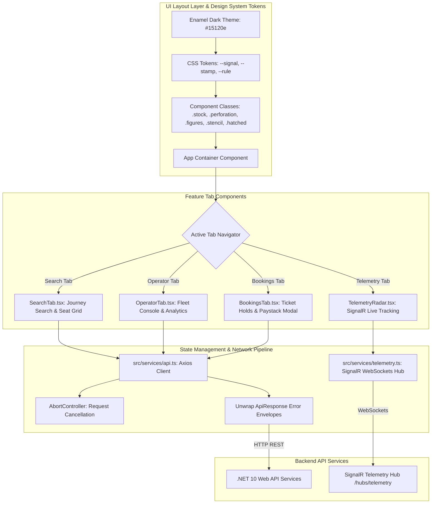

# Frontend Design System & UI Architecture

This document details BitRoute's frontend architecture, component design system (**"Enamel Departure Board at Night"**), design tokens, state management, `AbortController` network cancellation, and WAI-ARIA accessibility implementation.

---

## 1. Explained for a 12-Year-Old

Imagine walking into a classic train station at night:

1. **The Illuminated Departure Board**: Big glowing amber lights (`--signal`) against a dark enamel steel background (`--surface`) tell you when the next train leaves.
2. **Paper Punch-Card Tickets**: When you book a seat, your ticket looks like a physical paper ticket with dashed tear lines (`.perforation`) and little circular punch-out holes on the sides.
3. **No Jumping Text**: Numbers for fares and arrival times use special fixed-width numbers (`font-mono figures` with `tabular-nums`) so the clock numbers never jump or wobble as time ticks!
4. **Instant Cancel Button**: If you click to search for a trip and then quickly change your mind, the web page uses a secret network brake pedal (`AbortController`) to immediately stop the old search so your screen stays fast and crisp!

---

## 2. Deep-Dive Interview Defense Guide

### Technical Explanation

### 1. The "Enamel Departure Board at Night" Design System
BitRoute's UI is designed around a specialized transportation domain aesthetic:
- **Color Palette & Contrast**: Dark ground (`#15120e`) with elevated surface layers (`surface-raised`, `surface-sunk`), bordered by warm dark rules (`#332d24`). Accent signals include Amber (`--signal`) for primary actions/telemetry and Emerald (`--stamp`) for confirmation badges.
- **Physical Ticket Skeuomorphism**:
  - Panel stock (`.stock`): Raised ticket card with top lighting rather than floating box shadows.
  - Perforations (`.perforation`): Dashed top rules paired with `::before` and `::after` semi-circle pseudo-elements matching page background to simulate punched paper tickets.
  - Hatched sold seats (`.hatched`): 45-degree diagonal stripe pattern paired with lock icons to ensure occupancy is never communicated by color alone (WCAG 2.1 compliance).
- **Tabular Numerals**: Uses `font-variant-numeric: tabular-nums` and `font-feature-settings: 'tnum' 1` on all price, timestamp, and index numbers to prevent width layout jitter during real-time updates.

### 2. Component Architecture & State Orchestration
The UI is modularized into feature tabs coordinated by a central top-level view:
- **`SearchTab.tsx`**: Route segment discovery, seat availability grid, and 10-minute hold reservation trigger.
- **`OperatorTab.tsx`**: Operator fleet console managing routes, vehicles, schedule creation, driver GPS pings, leg-by-leg occupancy progress bars, historical breadcrumbs, and operator user provisioning.
- **`TelemetryRadar.tsx`**: Live real-time driver tracking radar connected via SignalR (`/hubs/telemetry`).
- **`BookingsTab.tsx`**: User ticket management, active hold countdown timers, and Paystack checkout modal triggers.

### 3. Network Resilience & AbortController Cancellation
To prevent **out-of-order race conditions** when users quickly toggle tabs or date pickers, every async API call passes an `AbortSignal`. When dependencies change, the previous `useEffect` cleanup handler invokes `controller.abort()`, cancelling pending HTTP requests in-flight.

---

## 3. Trade-Off Analysis & Why We Chose This Method

| Approach | Pros | Cons | Why BitRoute Chose / Rejected |
|---|---|---|---|
| **Generic UI Component Library (Bootstrap / MUI)** | Pre-built components; fast setup. | Generic look; heavy bundle size; lacks transport ticket domain identity. | ❌ **Rejected**: Lacks domain elegance and visual impact. |
| **Tailwind Utility Classes Only** | Flexible utility styling. | HTML clutter with duplicated 20-class strings across components. | ⚠️ **Partial**: Used alongside semantic CSS component classes (`.stock`, `.perforation`, `.figures`). |
| **Tailwind + Custom CSS Design System + AbortController** | High-performance design tokens; domain skeuomorphism; zero race conditions; full WAI-ARIA compliance. | Requires custom CSS architecture. | ✅ **CHOSEN**: Gold standard for domain-driven frontend engineering. |

---

## 4. Detailed Design System Architecture Diagram



---

## 5. Production Code Samples

### Design System CSS Tokens & Ticket Components
From `frontend/src/index.css`:

```css
@layer base {
  :root {
    color-scheme: dark;
    --surface: #15120e;
    --rule: #332d24;
  }
}

@layer components {
  /* Raised ticket panel stock */
  .stock {
    @apply bg-surface-raised border border-rule rounded-ticket shadow-stub;
  }

  /* Physical ticket perforation with punch-out holes */
  .perforation {
    position: relative;
    border-top: 1px dashed var(--rule);
  }

  .perforation::before,
  .perforation::after {
    content: '';
    position: absolute;
    top: 50%;
    width: 14px;
    height: 14px;
    border-radius: 9999px;
    background: var(--surface);
    border: 1px solid var(--rule);
    transform: translateY(-50%);
  }

  .perforation::before { left: -8px; clip-path: inset(0 0 0 50%); }
  .perforation::after { right: -8px; clip-path: inset(0 50% 0 0); }

  /* Tabular figures for stable width numbers */
  .figures {
    @apply font-mono;
    font-variant-numeric: tabular-nums;
  }
}
```

### AbortController Network Cancellation & Async Data Orchestration
From `frontend/src/components/OperatorTab.tsx`:

```typescript
useEffect(() => {
  if (!simScheduleId) return;
  const controller = new AbortController();

  const fetchTelemetryAndAnalytics = async () => {
    setIsLoadingAnalytics(true);
    setIsLoadingHistory(true);
    try {
      const [analytics, history] = await Promise.all([
        api.getScheduleAnalytics(simScheduleId, analyticsTravelDate, controller.signal).catch(() => null),
        api.getTelemetryHistory(simScheduleId, 50, controller.signal).catch(() => []),
      ]);
      if (controller.signal.aborted) return;
      setScheduleAnalytics(analytics);
      setTelemetryHistory(history);
    } finally {
      if (!controller.signal.aborted) {
        setIsLoadingAnalytics(false);
        setIsLoadingHistory(false);
      }
    }
  };

  void fetchTelemetryAndAnalytics();
  return () => controller.abort();
}, [simScheduleId, analyticsTravelDate]);
```

### API Error Envelope Unwrapping
From `frontend/src/services/api.ts`:

```typescript
export const toErrorMessage = (err: unknown): string => {
  if (axios.isAxiosError(err)) {
    const data = err.response?.data as ApiResponse<unknown> | undefined;
    if (data?.errors && Object.keys(data.errors).length > 0) {
      const firstField = Object.keys(data.errors)[0];
      return `${firstField}: ${data.errors[firstField][0]}`;
    }
    if (data?.message) {
      return data.message;
    }
  }
  return err instanceof Error ? err.message : 'An unexpected error occurred.';
};
```
