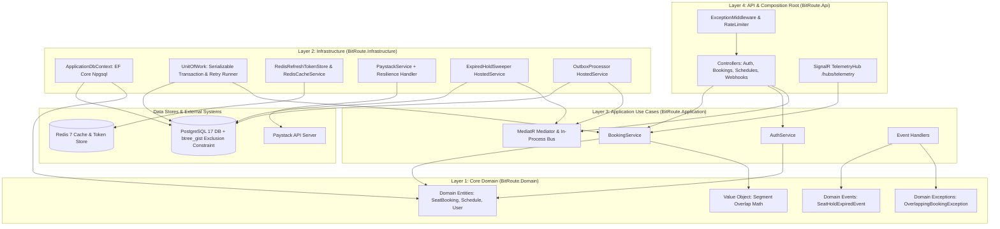
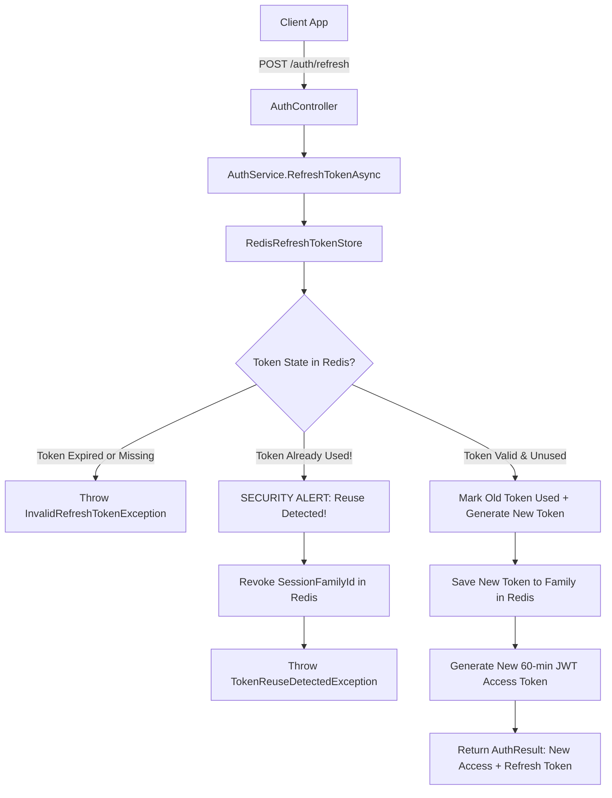
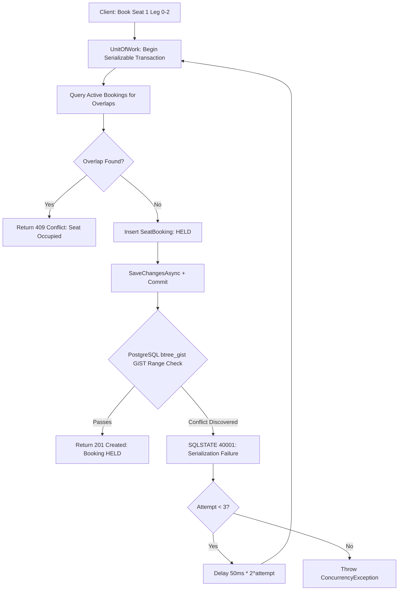
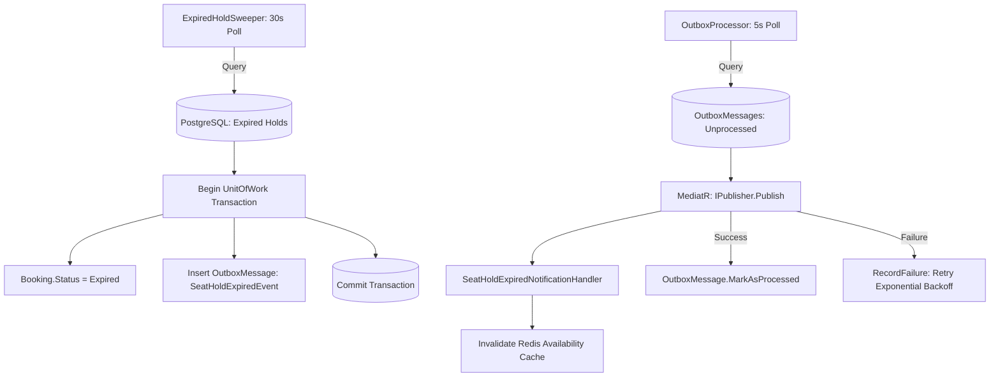
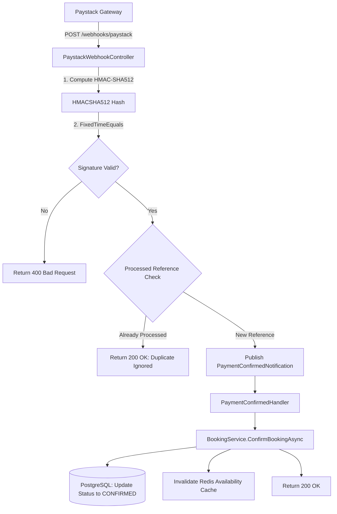
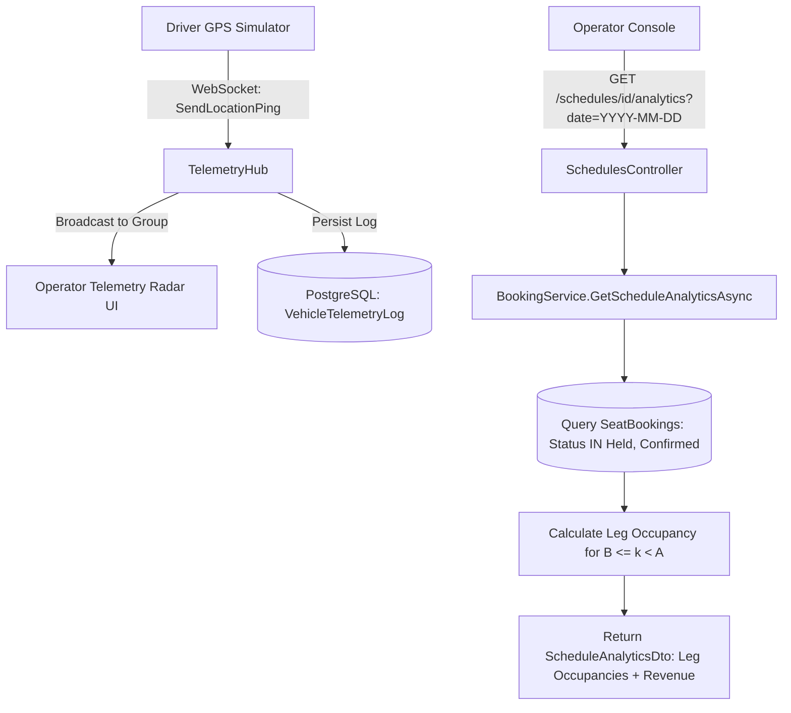
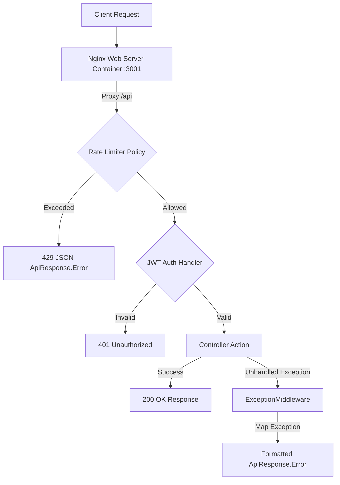

# Backend Architecture & Senior Engineer Technical Defense Guide

This document is the master technical defense guide for BitRoute's backend architecture. It covers every subsystem from Auth, Booking, Outbox, Payments, Telemetry, and Security to Infrastructure, detailing **how the logic works, why specific decisions were made, code implementations, trade-offs, and exact Senior/Principal Staff Engineer interview Q&A defenses**.

---

## Table of Contents
1. [Clean Architecture Layering & Boundary Rules](#1-clean-architecture-layering--boundary-rules)
2. [Subsystem 1: Identity, Auth & Sliding Refresh-Token System](#2-subsystem-1-identity-auth--sliding-refresh-token-system)
3. [Subsystem 2: Multi-Leg Segment Inventory & Concurrency Overlap Engine](#3-subsystem-2-multi-leg-segment-inventory--concurrency-overlap-engine)
4. [Subsystem 3: Reserve-Then-Confirm Hold & Transactional Outbox Pattern](#4-subsystem-3-reserve-then-confirm-hold--transactional-outbox-pattern)
5. [Subsystem 4: Payment Gateway, Gateway Resilience & Webhook Settlement](#5-subsystem-4-payment-gateway-gateway-resilience--webhook-settlement)
6. [Subsystem 5: Real-Time Telemetry & Segment Fleet Analytics](#6-subsystem-5-real-time-telemetry--segment-fleet-analytics)
7. [Subsystem 6: Defense-in-Depth Security, Middleware & Docker Infrastructure](#7-subsystem-6-defense-in-depth-security-middleware--docker-infrastructure)
8. [Senior Engineer Comprehensive QA Interview Defense Matrix](#8-senior-engineer-comprehensive-qa-interview-defense-matrix)

---

## 1. Clean Architecture Layering & Boundary Rules

BitRoute follows strict **Clean Architecture (Onion / Hexagonal Architecture)** principles:

$$\text{Domain} \impliedby \text{Application} \impliedby \text{Infrastructure} \impliedby \text{Api}$$



### Why Clean Architecture?
- **Domain Independence**: The `BitRoute.Domain` project contains zero framework references (no EF Core attributes, no ASP.NET packages).
- **Testability**: Domain logic (overlap math, price calculation, status transitions) is tested in pure, lightning-fast unit tests without mocking databases.
- **Enforcement**: NetArchTest rules in `tests/BitRoute.ArchitectureTests` enforce layer isolation at build time:

```csharp
[Fact]
public void Domain_Should_Not_HaveDependencyOnOtherProjects()
{
    var result = Types.InAssembly(typeof(BitRoute.Domain.Entities.SeatBooking).Assembly)
        .Should()
        .NotHaveDependenciesOn("BitRoute.Application", "BitRoute.Infrastructure", "BitRoute.Api")
        .GetResult();

    Assert.True(result.IsSuccessful, "Domain layer must not depend on external projects.");
}
```

---

## 2. Subsystem 1: Identity, Auth & Sliding Refresh-Token System

### Business & Technical Logic
1. **Password Security**: Passwords are hashed using ASP.NET Core Identity's `IPasswordHasher<User>` (PBKDF2 with HMAC-SHA256, 100,000 iterations).
2. **Short-Lived Access Tokens**: JWT access tokens carry `UserId`, `Email`, `Role` (`Passenger`, `Operator`, `Admin`), expiring in **60 minutes**.
3. **Sliding Refresh Window**: 30-day sliding refresh tokens stored in Redis. When a token is refreshed:
   - Old refresh token is invalidated.
   - A new refresh token is issued within the same `SessionFamilyId`.
   - The 30-day window slides forward.
4. **Token Family Reuse Detection**: If an already-consumed refresh token is presented (indicating a stolen token replay attack), BitRoute immediately revokes the **entire `SessionFamilyId` in Redis**, invalidating all active sessions for that user family.



### Senior Engineer Q&A Defense

**Q1: Why store refresh tokens in Redis instead of PostgreSQL?**
> **Defense**: Refresh token validation occurs on every token refresh. Storing tokens in PostgreSQL creates heavy write and IOPS thrashing on the primary database due to constant token rotations and expiration updates. Redis provides sub-millisecond in-memory lookups, native key TTL expiration (`EXPIRE`), and atomic operations (`EVAL` / Redis transactions) without impacting primary DB transactional capacity.

**Q2: How do you handle race conditions when two concurrent requests refresh using the same refresh token simultaneously?**
> **Defense**: We execute token consumption atomically in Redis. If a duplicate refresh request arrives within milliseconds of the first, the first request marks `IsUsed = true`. The second request detects `IsUsed == true`, triggering token family revocation to protect against token theft.

---

## 3. Subsystem 2: Multi-Leg Segment Inventory & Concurrency Overlap Engine

### Business & Technical Logic
1. **Segment Indexing**: Stops along a route are ordered $0, 1, 2, 3, \dots$. A journey from Stop $i$ to Stop $j$ occupies the half-open interval $[i, j)$.
2. **Half-Open Interval Overlap Formula**:
   $$\text{ExistingStart} < \text{RequestedEnd} \quad \text{AND} \quad \text{ExistingEnd} > \text{RequestedStart}$$
   *Example*: $[0, 2)$ (Lagos to Ibadan) and $[2, 4)$ (Ibadan to Abuja) **do not overlap** because $0 < 4$ is true, but $2 > 2$ is **false**. Seat 1 serves both passengers cleanly.

3. **Dual-Defense Concurrency Control**:
   - **Application Guard**: Transactions run inside `IsolationLevel.Serializable`. PostgreSQL's SSI algorithm tracks SIREAD locks. If two requests attempt to book overlapping legs on the same seat simultaneously, PostgreSQL aborts one transaction with SQLSTATE `40001` (`serialization_failure`). BitRoute's `UnitOfWork` catches `40001` and executes exponential backoff retries (3 attempts).
   - **Database Guard**: PostgreSQL `btree_gist` range exclusion constraint:

```sql
CREATE EXTENSION IF NOT EXISTS btree_gist;

ALTER TABLE seat_bookings
ADD CONSTRAINT no_overlapping_legs
EXCLUDE USING gist (
  schedule_id WITH =,
  travel_date WITH =,
  seat_id     WITH =,
  int4range(boarding_index, alighting_index, '[)') WITH &&
) WHERE (status IN ('held', 'confirmed'));
```



### Senior Engineer Q&A Defense

**Q1: Why half-open intervals $[i, j)$ instead of closed intervals $[i, j]$?**
> **Defense**: Closed intervals $[0, 2]$ and $[2, 4]$ overlap at point 2. In transport, Stop 2 is where Passenger 1 alights and Passenger 2 boards. Using half-open $[i, j)$ mathematically represents legs as continuous non-overlapping ranges where `AlightingIndex` of Leg 1 matches `BoardingIndex` of Leg 2 without requiring awkward $-1$ index adjustments.

**Q2: What is the performance overhead of PostgreSQL `btree_gist` vs Pessimistic Locking (`SELECT FOR UPDATE`)?**
> **Defense**: `SELECT FOR UPDATE` locks entire vehicle seat rows, creating massive lock contention and serializing all concurrent bookings for a departure. `btree_gist` range exclusion indexes allow non-overlapping bookings to execute in parallel at full speed, only serializing actual interval collisions at the database engine level.

---

## 4. Subsystem 3: Reserve-Then-Confirm Hold & Transactional Outbox Pattern

### Business & Technical Logic
1. **10-Minute Hold Reservation**: `SeatBooking.CreateHeld()` reserves a seat for 10 minutes (`HoldExpiresAtUtc = UtcNow + 10m`).
2. **Expired Hold Sweeper**: `ExpiredHoldSweeper` runs every 30 seconds, fetching expired holds (`Status == Held AND HoldExpiresAtUtc <= UtcNow`), expiring them (`ExpireHold`), and publishing `SeatHoldExpiredEvent`.
3. **The Dual-Write Problem Solution**: When expiring a hold or confirming a payment, updating the database and publishing a message to a broker in separate network calls creates inconsistency if one succeeds and the other fails.
4. **Transactional Outbox**: BitRoute writes an `OutboxMessage` row inside the **exact same database transaction** as the booking status change.
5. **Outbox Processor Worker**: `OutboxProcessor` polls `OutboxMessages` (`ProcessedAtUtc == null AND NextAttemptUtc <= UtcNow`), deserializes payloads, publishes via MediatR `IPublisher`, and marks them processed. Failed messages retry with exponential backoff (`2^RetryCount` seconds) and quarantine to dead-letter state after 5 failures.



### Senior Engineer Q&A Defense

**Q1: How does the Outbox Pattern guarantee At-Least-Once event delivery?**
> **Defense**: Because the `OutboxMessage` is inserted in the same ACID database transaction as the entity state update, the event is guaranteed to be persisted if and only if the business operation succeeds. The `OutboxProcessor` continuously polls and retries pending messages until acknowledged.

**Q2: What happens if the `OutboxProcessor` process crashes after publishing to MediatR but before marking the outbox message as processed?**
> **Defense**: The message will be picked up on the next worker cycle and re-published (At-Least-Once delivery). Downstream event handlers (e.g. cache invalidators) are designed to be **idempotent**, ensuring re-processing causes zero side effects.

---

## 5. Subsystem 4: Payment Gateway, Gateway Resilience & Webhook Settlement

### Business & Technical Logic
1. **Minor Units Handling**: All fares are stored as integer kobo (`PriceInKobo`) to eliminate floating-point rounding errors.
2. **Zero-Trust Webhook Verification**: Paystack webhooks (`POST /webhooks/paystack`) contain an `x-paystack-signature` header.
3. **Constant-Time HMAC-SHA512 Verification**: `PaystackService.VerifyWebhookSignature` uses `CryptographicOperations.FixedTimeEquals` to compare calculated HMAC hashes against the header, preventing timing side-channel attacks.
4. **Idempotent Settlement**: Webhook references are deduplicated via a concurrency-safe registry (`ProcessedReferences`). Valid signatures publish `PaymentConfirmedNotification` via MediatR, executing `BookingService.ConfirmBookingAsync`.
5. **Gateway Resilience**: `IPaystackService` is registered with `Microsoft.Extensions.Http.Resilience`:
   - 3 retries with exponential backoff.
   - Circuit breaker (trips if >50% requests fail in 30s).
   - 10s per-attempt timeout.



### Senior Engineer Q&A Defense

**Q1: Explain timing attacks on webhook signature verification and how `FixedTimeEquals` prevents them.**
> **Defense**: Standard `string.Equals()` compares characters sequentially and returns `false` on the first mismatch. An attacker can send random signatures, measure HTTP response times in nanoseconds, and infer how many characters were correct based on small latency spikes. `CryptographicOperations.FixedTimeEquals` executes an bitwise XOR across all bytes in constant time regardless of where mismatches occur, completely eliminating timing leakage.

**Q2: What is the purpose of the Circuit Breaker in HTTP Gateway Resilience?**
> **Defense**: If Paystack experiences an outage, unbound retries would block server threads, fill connection pools, and crash BitRoute. The Circuit Breaker monitors failure rates. When failures exceed 50%, it "opens the circuit", instantly failing subsequent calls without waiting for network timeouts, giving Paystack time to recover while preserving BitRoute thread availability.

---

## 6. Subsystem 5: Real-Time Telemetry & Segment Fleet Analytics

### Business & Technical Logic
1. **SignalR Duplex WebSockets**: Drivers stream pings to `TelemetryHub` (`/hubs/telemetry`). Updates broadcast to schedule subscribers (`Clients.Group(scheduleId)`).
2. **Historical Breadcrumb Logs**: Pings persist as `VehicleTelemetryLog` rows. `TelemetryRepository.GetHistoryByScheduleIdAsync` returns breadcrumbs clamped between $1 \le \text{limit} \le 500$.
3. **Segment Occupancy Algorithm**: For legs $L_0, \dots, L_{n-1}$, leg occupancy $O_k$ counts active bookings (`Held` or `Confirmed`) whose range covers leg $k$:
   $$O_k = \sum \{ \text{Booking} \mid \text{Status} \in \{\text{Held}, \text{Confirmed}\}, \text{BoardingIndex} \le k < \text{AlightingIndex} \}$$
4. **Revenue Tracking**: Confirmed revenue $R = \sum \{ \text{Booking.PriceInKobo} \mid \text{Status} = \text{Confirmed} \}$.



### Senior Engineer Q&A Defense

**Q1: Why isolate telemetry WebSockets from transactional booking databases?**
> **Defense**: Telemetry produces high-frequency, ephemeral data (multiple pings/sec per vehicle). Concurrency-sensitive transactional booking requires strict ACID guarantees. Keeping telemetry streaming over SignalR and writing logs asynchronously prevents high-frequency GPS writes from polluting database transaction logs or competing for table locks with booking transactions.

---

## 7. Subsystem 6: Defense-in-Depth Security, Middleware & Docker Infrastructure

### Business & Technical Logic
1. **ASP.NET Core Rate Limiting**: Fixed-window limiters in `Program.cs`:
   - `AuthPolicy`: 10 req/min (IP-based).
   - `HoldPolicy`: 30 req/min.
   - `PublicSearchPolicy`: 60 req/min.
   - Custom `OnRejected` writes standard `ApiResponse.Error("Rate limit exceeded...")` 429 JSON payload.
2. **Global Exception Middleware**: `ExceptionMiddleware` catches domain exceptions (`ConcurrencyException`, `NotFoundException`, `DomainException`) and maps them to clean HTTP response codes (400, 404, 409, 500) with `ApiResponse.Error`.
3. **Multi-Stage Docker Orchestration**: `Dockerfile` uses multi-stage builds (`sdk:10.0` build stage, `aspnet:10.0` runtime stage). `docker-compose.yml` orchestrates PostgreSQL 17, Redis 7, BitRoute API, and Vite Nginx Web Server with `healthcheck` dependencies (`pg_isready`, `redis-cli ping`).



---

## 8. Senior Engineer Comprehensive QA Interview Defense Matrix

| Question | Core Technical Concept | Staff / Principal Engineer Defense |
|---|---|---|
| **1. How does BitRoute prevent double-booking on overlapping journey legs under 1,000 req/sec?** | Segment Interval Math & Dual-Defense Concurrency | Journeys are mapped to half-open intervals $[i, j)$. We defend inventory at two levels: (1) `IsolationLevel.Serializable` transactions in `UnitOfWork` retry on SQLSTATE `40001` conflict detection; (2) PostgreSQL `btree_gist` GiST exclusion constraint (`int4range`) physically blocks overlapping rows in PostgreSQL. |
| **2. Why use the Transactional Outbox pattern instead of publishing MediatR events directly?** | Dual-Write Problem & ACID Event Guarantees | Direct publishing creates inconsistency if the DB commit succeeds but cache/notification calls fail. The outbox pattern writes `OutboxMessage` rows inside the *same* database transaction as the domain entity update. `OutboxProcessor` polls and dispatches with exponential backoff and dead-lettering, guaranteeing At-Least-Once delivery. |
| **3. How do you protect webhook endpoints from forged requests and timing attacks?** | Cryptographic Signature Verification & Side-Channel Mitigation | Paystack sends `x-paystack-signature` (HMAC-SHA512). We compute the hash over raw body bytes and compare using `CryptographicOperations.FixedTimeEquals`. Standard string comparison leaks timing information based on matching character counts; `FixedTimeEquals` runs in constant time, preventing timing side-channel attacks. |
| **4. How does your refresh-token system defend against token theft?** | Sliding Refresh Window & Token Family Revocation | Refresh tokens are stored in Redis with a 30-day sliding TTL and grouped by `SessionFamilyId`. When refreshed, the token rotates. If a previously-used refresh token is presented, BitRoute flags a theft attempt and revokes the *entire* `SessionFamilyId` in Redis, forcing all devices in that session family to re-authenticate. |
| **5. How do you handle third-party gateway downtime (e.g. Paystack API outage)?** | HTTP Gateway Resilience & Circuit Breaking | `IPaystackService` is decorated with `Microsoft.Extensions.Http.Resilience`. It enforces 3 retries with exponential backoff, 10s per-attempt timeouts, and a Circuit Breaker that opens if >50% calls fail in 30s, failing fast to prevent server thread pool starvation. |
| **6. Why represent money as integer kobo instead of decimals or floats?** | Financial Precision & IEEE 754 Floating-Point Limits | Binary floating-point representation (`double`, `float`) suffers from precision loss (e.g. `0.1 + 0.2 != 0.3`). By using 64-bit integer minor units (kobo), all financial calculations execute as exact integer arithmetic, eliminating rounding discrepancies. |
| **7. How do you ensure clean container startup ordering in Docker Compose?** | Container Healthchecks & `depends_on` Conditions | Containers starting before databases are ready crash on initial connection. We define native healthchecks (`pg_isready` for PostgreSQL, `redis-cli ping` for Redis) and configure `api` with `depends_on: { postgres: { condition: service_healthy }, redis: { condition: service_healthy } }`, guaranteeing clean startup ordering. |
