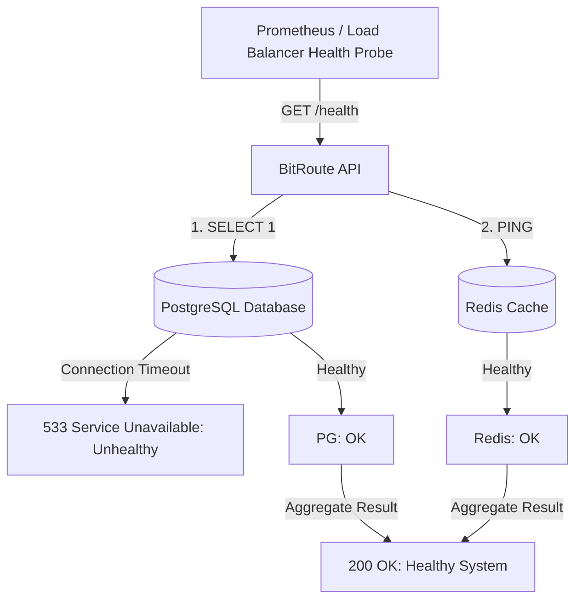

# Production Operations, Monitoring & Troubleshooting Runbook

This document is the operational runbook and performance tuning guide for BitRoute in production environments. It covers system health checks, database indexing strategies, incident troubleshooting runbooks, and senior staff engineer operational Q&A.

---

## 1. Explained for a 12-Year-Old

Imagine running a giant amusement park:

1. **Park Health Monitors**: Automated sensors check every ride (PostgreSQL database, Redis cache, Web server) every 5 seconds to make sure no ride breaks down while guests are in line.
2. **Fast Pass Lanes (Database Indexes)**: Instead of searching through a huge stack of 100,000 tickets one by one, we keep special sorted index cards so the computer finds your ticket in less than 1 millisecond!
3. **Emergency Fix Guides (Runbooks)**: If the internet lags or a payment machine hiccups, the workers have a quick step-by-step instruction manual to fix the problem immediately without closing the park.

---

## 2. Deep-Dive Interview Defense Guide

### Technical Explanation

### 1. Production Health Monitoring Architecture
BitRoute provides multi-layer health checks:
- **`GET /health`**: ASP.NET Core Health Checks endpoint reporting overall system health (`Healthy`, `Degraded`, `Unhealthy`).
- **PostgreSQL Health Check**: Executes `pg_isready -U bitroute -d bitroute` inside Docker containers. Checks DB connection pool availability.
- **Redis Health Check**: Executes `redis-cli ping` (expects `PONG`). Verifies memory availability and key eviction behavior.
- **SignalR Connection Diagnostics**: Monitors WebSocket handshakes and active connection counts on `/hubs/telemetry`.



### 2. Database Indexing & Query Optimization Strategy
To maintain sub-millisecond query latency under millions of rows:

1. **Segment Availability Index**:
   ```sql
   CREATE INDEX idx_seat_bookings_availability 
   ON seat_bookings (schedule_id, travel_date, status) 
   INCLUDE (seat_id, boarding_index, alighting_index);
   ```
   *Rationale*: Allows index-only scans for availability checking without touching table heap pages.

2. **Outbox Processor Polling Index**:
   ```sql
   CREATE INDEX idx_outbox_unprocessed 
   ON outbox_messages (next_attempt_utc, created_at_utc) 
   WHERE processed_at_utc IS NULL;
   ```
   *Rationale*: Partial index filtering exclusively on unprocessed outbox rows (`WHERE processed_at_utc IS NULL`). Keeps index footprint microscopic even after millions of events are processed.

3. **Telemetry History Index**:
   ```sql
   CREATE INDEX idx_telemetry_schedule_timestamp 
   ON vehicle_telemetry_logs (schedule_id, timestamp DESC);
   ```
   *Rationale*: Supports fast limit-clamped queries for historical driver breadcrumbs (`ORDER BY timestamp DESC LIMIT 50`).

---

## 3. Operational Incident Runbooks

### Incident 1: High Rate of Serialization Failures (`SQLSTATE 40001`)
- **Symptom**: Spikes in 409 Conflict / ConcurrencyException during high-demand departure ticket releases (flash sales).
- **Root Cause**: Excessive concurrent requests contending for identical seat segments on the same departure.
- **Remediation**:
  1. Verify application retry loop is active (3 retries with exponential backoff in `UnitOfWork`).
  2. Increase Redis availability cache aggressive pre-filtering so invalid requests get rejected at the cache level before reaching PostgreSQL serializable transactions.
  3. Ensure client UI implements randomized jitter on retry buttons.

### Incident 2: Paystack Webhook Signature Verification Failures
- **Symptom**: Paystack webhooks return `400 Bad Request` with message `"Invalid Paystack signature."`.
- **Root Cause**: Mismatched `Paystack:SecretKey` or payload truncation by reverse proxy buffer limits.
- **Remediation**:
  1. Check `Paystack:SecretKey` environment variable against Paystack Dashboard keys (test vs live mode).
  2. Inspect Nginx raw body buffering settings (`client_body_buffer_size 128k;`).
  3. Re-test webhook using Paystack webhook simulator.

### Incident 3: SignalR WebSockets Dropping Connections Under Nginx
- **Symptom**: Frontend console shows `SignalR connection disconnected. Reconnecting...` every 60 seconds.
- **Root Cause**: Default Nginx proxy read timeout (60s) tearing down idle WebSocket connections.
- **Remediation**:
  Configure `nginx.conf` with long-lived WebSocket proxy settings:
  ```nginx
  location /hubs/ {
      proxy_pass http://api:5000/hubs/;
      proxy_http_version 1.1;
      proxy_set_header Upgrade $http_upgrade;
      proxy_set_header Connection $connection_upgrade;
      proxy_buffering off;
      proxy_read_timeout 3600s;
      proxy_send_timeout 3600s;
  }
  ```

---

## 4. Senior Staff Engineer Operational QA Matrix

| Question | Core Operational Concept | Senior Staff Engineer Defense |
|---|---|---|
| **1. How do you monitor and clear dead-lettered outbox messages in production?** | Outbox Dead-Lettering & Operational Observability | Outbox messages that fail 5 consecutive times are marked with error tracebacks. We monitor dead-letter count via Prometheus metrics (`outbox_dead_letter_total`). An admin endpoint (`POST /admin/outbox/retry`) allows operators to inspect payloads, fix upstream issues, and reset `NextAttemptUtc` to re-queue the messages safely. |
| **2. How do you prevent Redis out-of-memory (OOM) crashes under heavy load?** | Redis Memory Policies & TTL Management | All keys stored in Redis explicitly enforce TTL expiration windows (e.g. 60m for access cache, 30d for refresh tokens). We configure Redis `maxmemory` limit with `volatile-ttl` eviction policy, ensuring that if memory pressure builds, Redis automatically evicts keys closest to expiration while preserving active session keys. |
| **3. How do you execute zero-downtime database schema migrations for PostgreSQL `btree_gist` constraints?** | Zero-Downtime Migration Engineering | Schema migrations adding constraints (`ADD CONSTRAINT no_overlapping_legs`) acquire exclusive table locks. In production, we run `CREATE INDEX CONCURRENTLY` for index creation ahead of time, and apply table constraints using `NOT VALID` followed by `VALIDATE CONSTRAINT` in separate zero-downtime deployment phases. |
